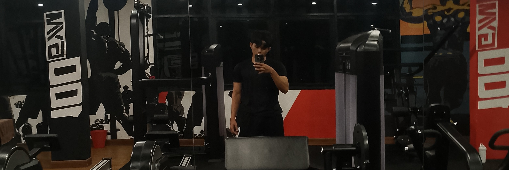

  

<h1 align="center">Muhammad Zaidan Fadhlurrahman</h1>
<h3 align="center">Full-Stack Software Engineer</h3>

  Informatics Engineering student at Institut Teknologi Indonesia with a strong foundation in building scalable web applications, mobile engineering, and decentralized technologies. Passionate about software architecture, clean code principles, and translating complex requirements into robust technical solutions.

  
  
  
  
  
    
  

---

### Technical Skills & Arsenal

**Programming Languages**  

**Frameworks & Libraries**  

**Databases & Operations**  

---

### Core Development Focus

*Below is an overview of my primary engineering domains, reflecting the architecture and scope of my public and private repositories:*

- **Enterprise Web Architecture**: Architecting and developing robust, full-stack systems (e.g., Facility Booking Platforms) implementing Clean Architecture principles, JWT-based security, and reactive user interfaces using Go (Gin) and Vue.js.
- **Cross-Platform Mobile Engineering**: Building high-performance, offline-first mobile applications with Flutter and Dart. Implementing advanced state management, local NoSQL caching, and background synchronization for market analytics.
- **Web3 & Decentralized Systems**: Engineering decentralized application (dApp) interfaces and writing secure smart contracts for zero-fee token swaps on Ethereum testnets using Solidity, Next.js, and Ethers.js.
- **Modern Backend Integration**: Utilizing tools like Supabase and Prisma ORM to create seamless, automated data management flows for rapid application deployment.
- **Data Science & Analysis**: Processing and analyzing historical data trends using predictive modeling tools like RapidMiner to deliver accurate forecasting solutions.
  
---

### GitHub Analytics

  
  

